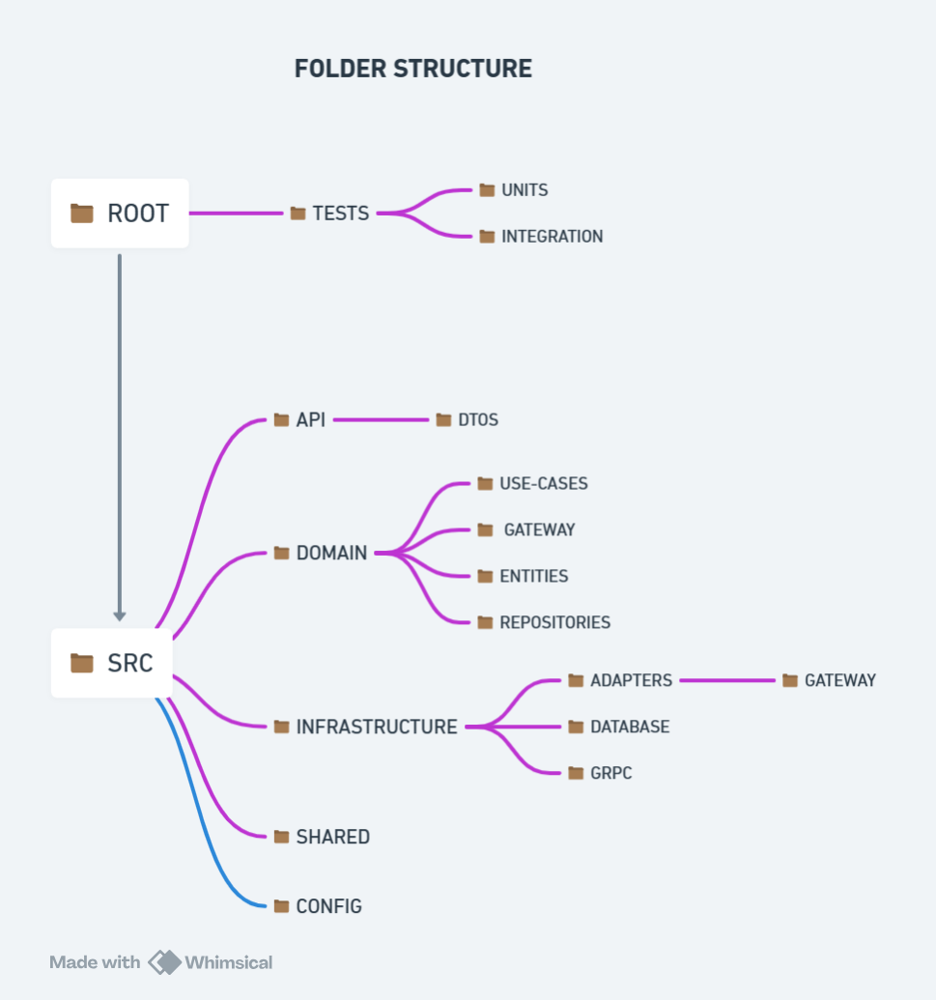

# Microsserviço Nest Base - v1.0.0

Este repositório serve como um template padrão para microserviços escritos em NestJS, visando agilizar o desenvolvimento inicial de aplicações. Nosso objetivo é facilitar a colaboração da comunidade neste projeto, por isso, encorajamos contribuições que ajudem a melhorar e expandir este template.

## Representação Visual

Aqui, você encontra uma representação visual das estruturas de pastas do microserviço, facilitando o entendimento da organização do projeto.



[Esquema no Whimsical](https://whimsical.com/folder-structure-SEmPne5aSCo1TcUbKDYQP4)

- **ROOT**: Raiz do projeto
  - **SRC**: Pasta principal do aplicativo, contendo toda a lógica de negócios e o código-fonte.
    - **DOMAIN**: Coração da lógica de negócios, definindo 'Entities' e 'Repositories'.
      - **ENTITIES**: Representam as entidades de negócios e objetos do domínio.
      - **REPOSITORIES**: Interfaces para a camada de acesso a dados, abstraindo a lógica de persistência.
      - **USE-CASES**: Contêm a lógica de aplicação, coordenando o fluxo de dados entre a UI e o domínio.
      - **GATEWAY**: Adaptadores para conexão com microserviços externos.
    - **INFRASTRUCTURE**: Detalhes técnicos que suportam as camadas de aplicação, como banco de dados e comunicação de rede.
      - **ADAPTERS**: Implementações concretas de interfaces, como adaptadores de banco de dados ou serviços externos.
      - **DATABASE**: Configurações e scripts relacionados ao banco de dados.
      - **GRPC**: Interfaces protobuf para comunicação via gRPC.
    - **REPRESENTATION**: Define interfaces de usuário, incluindo adaptadores para frameworks MVC, APIs REST, etc.
    - **CONFIG**: Configurações gerais usáveis em todo o aplicativo, como strings de conexão de banco de dados, variáveis de ambiente, etc.
  - **TESTS**: Testes unitarios e testes de integração.
    - **UNITS**: Testes voltados a funções da aplicação.
    - **INTEGRATION**: Testes voltados as inteções que o serviço utiliza.

## Boas Práticas

- Nomeie variáveis, funções e classes claramente para refletir seu propósito.
- Mantenha funções focadas em uma única ação e curtas.
- Organize o código logicamente, agrupando funções relacionadas.
- Comente apenas para explicar o "porquê", não o "o quê".

### Uso de Console.log

O `console.log` é útil para depuração, mas deve ser usado com parcimônia. Prefira o Logger do próprio NestJS para manter o código limpo e performático.

### Padrão CamelCase

- Utilize camelCase para nomear variáveis e funções, mantendo consistência em todo o projeto.

## Configuração

Siga estes passos para rodar o código localmente:

1. Copie `.env.example` para `.env` e atualize as variáveis conforme necessário.
2. Instale as dependências:
   ```bash
   npm install
   ```
3. Gere as models do Prisma:
   ```bash
   npx prisma generate
   ```
4. Inicialize o Husky:
   ```bash
   npm run prepare
   ```
5. Inicie o projeto:
   ```bash
   npm run start:dev
   ```

## Contribuindo

Para contribuir com o projeto, siga estes passos:

1. Faça um fork do repositório.
2. Clone o seu fork para a sua máquina local.
3. Crie uma nova branch para a sua contribuição.
4. Faça suas alterações e realize commits seguindo o padrão dos Commits Convencionais.
5. Envie sua branch e abra um Pull Request (PR) contra a branch `dev` do repositório original.

### Commits

Utilizamos o Husky + Commitlint para assegurar que os commits sigam o padrão dos Commits Convencionais. Para facilitar, configuramos um script que formata o commit por você:

1. Após fazer alterações, adicione-as:
   ```bash
   git add .
   ```
2. Execute o comando para iniciar o script de commit:
   ```bash
   npm run commit
   ```

### Branches

Padrão de branches:

- **master**: Código em produção.
- **dev**: Código de desenvolvimento e pré-homologação.
- **feature/_nome da feature_**: Código referente a uma atividade específica.

Para criar uma nova branch

do tipo feature de maneira rápida, configure um alias global:

```bash
git config --global alias.feature '!sh ./scripts/git-feature.sh'
```

Agora, você pode criar features facilmente com:

```bash
git feature
```

Suas contribuições são essenciais para tornar este projeto ainda melhor e mais eficiente!
